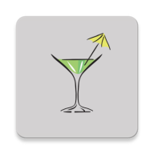

# Cocktails (final project for post-pc course)

Want to make a cocktail but need some help? Try out Cocktails app, explore and create different excellent cocktails, and get assisted with the app AR (Augmented reality) and TTS (text-to-speech) awesome features!

todo: replace link!!! 

## Features

-   Written Recipe
-   AR layout, help you measuring all the ingerdients amount over a presented cup
-   Text-to-speech tool, reading the chosen recipe out load
-   Custom Cocktails! Add your own cocktail to the app
-   Favorites functionality
-   Share recipe screenshot to your friends

fix images links after app is done

## Contributions

All contributions are welcome!
Please feel free to post questions, recommendations, ideas, bugs by create [new issue](https://github.com/zoharhen/Cocktails/issues/new) following the template or if you want create directly [new pull request](https://github.com/zoharhen/Cocktails/compare).

## Authors

**Zohar Hen**

**Shahaf Hermann**

**Einav Hasson**

